# Bản đồ kho văn bản luật — kcn-review

> Cập nhật: 2026-06-12 · **36 văn bản / 8 nhóm** · Nguồn sự thật về hiệu lực: `laws/metadata.csv`
> Dành cho team legal: xem quan hệ thay thế/sửa đổi/hướng dẫn trước khi review và khi bổ sung văn bản mới.
> Chú giải: 🟢 đang hiệu lực · 🟡 hiệu lực một phần / bị sửa đổi · 🔴 hết hiệu lực (giữ cho HĐ cũ) · ✏️ văn bản sửa đổi

## 1. Thống kê nhanh

| Nhóm | Số VB | Đang hiệu lực | Hết hiệu lực | Ghi chú |
|---|---|---|---|---|
| dat-dai | 8 | 8 | 0 | đầy đủ nhất — luật + 5 NĐ + NQ gỡ vướng |
| dau-tu | 9 | 8 | 1 (LĐT 2020) | gồm cả thuế TNDN + thuế tối thiểu toàn cầu |
| moi-truong | 9 | 9 | 0 | gồm cả PCCC; chuỗi NĐ 08 sửa 2 lần |
| dan-su | 4 | 4 | 0 | nền chung + trọng tài |
| kcn | 2 | 1 | 1 (NĐ 82) | NĐ 35 đang chờ NĐ thay thế (dự thảo) |
| da-nang | 3 | 3 | 0 | cơ chế đặc thù + Khu TMTD |
| lao-dong | 1 | 1 | 0 | |
| ho-chi-minh | 1 | 1 | 0 | dùng đối chiếu |

## 2. Sơ đồ quan hệ (GitHub tự render)

```mermaid
flowchart TB
  classDef active fill:#e8f5e9,stroke:#2e7d32
  classDef partial fill:#fff8e1,stroke:#f9a825
  classDef expired fill:#ffebee,stroke:#c62828
  classDef amend fill:#e3f2fd,stroke:#1565c0

  subgraph KCN["🏭 KCN / KKT"]
    ND82["🔴 NĐ 82/2018<br/>(HĐ ký trước 15/07/2022)"]:::expired
    ND35["🟢 NĐ 35/2022<br/>quản lý KCN-KKT"]:::active
    ND82 -- "bị thay thế bởi" --> ND35
  end

  subgraph DAUTU["💰 Đầu tư & Thuế"]
    LDT2020["🔴 Luật Đầu tư 2020<br/>(HĐ ký trước 01/03/2026)"]:::expired
    LDT2025["🟢 Luật Đầu tư 143/2025"]:::active
    ND31["🟡 NĐ 31/2021<br/>hướng dẫn LĐT"]:::partial
    ND239["✏️ NĐ 239/2025"]:::amend
    QD29["🟢 QĐ 29/2021<br/>ưu đãi đặc biệt"]:::active
    ND182["🟢 NĐ 182/2024<br/>Quỹ Hỗ trợ đầu tư"]:::active
    NQ107["🟢 NQ 107/2023<br/>thuế tối thiểu 15%"]:::active
    ND236["🟢 NĐ 236/2025"]:::active
    TNDN["🟢 Luật Thuế TNDN 67/2025"]:::active
    LDT2020 -- "bị thay thế bởi" --> LDT2025
    LDT2020 -. "hướng dẫn" .- ND31
    ND239 -- "sửa đổi" --> ND31
    ND31 -. "căn cứ" .- QD29
    NQ107 -. "hướng dẫn" .- ND236
    NQ107 == "trung hòa ưu đãi thuế suất<br/>→ chuyển sang hỗ trợ chi phí" ==> ND182
    TNDN -. "nền ưu đãi thuế" .- QD29
  end

  subgraph DATDAI["🌍 Đất đai & KD BĐS"]
    LDD["🟢 Luật Đất đai 2024"]:::active
    ND102["🟢 NĐ 102/2024"]:::active
    ND103["🟡 NĐ 103/2024<br/>tiền thuê đất"]:::partial
    ND291["✏️ NĐ 291/2025"]:::amend
    ND151["🟢 NĐ 151/2025<br/>phân quyền 2 cấp<br/>(đến 28/02/2027)"]:::active
    ND226["✏️ NĐ 226/2025"]:::amend
    NQ254["🟢 NQ 254/2025<br/>gỡ vướng thi hành"]:::active
    KDBDS["🟢 Luật KD BĐS 2023<br/>cho thuê lại QSDĐ"]:::active
    LDD -. "hướng dẫn" .- ND102
    LDD -. "hướng dẫn" .- ND103
    ND291 -- "sửa đổi" --> ND103
    ND226 -- "sửa đổi" --> ND151
    LDD -. "gỡ vướng" .- NQ254
    LDD <-. "cho thuê lại trong dự án" .-> KDBDS
  end

  subgraph MOITRUONG["🌿 Môi trường & PCCC"]
    BVMT["🟡 Luật BVMT 2020"]:::partial
    L146["✏️ Luật 146/2025<br/>sửa 15 luật NN-MT"]:::amend
    ND08["🟡 NĐ 08/2022<br/>giấy phép MT, đấu nối<br/>(+ bộ phụ lục)"]:::partial
    ND05["✏️ NĐ 05/2025"]:::amend
    ND48["✏️ NĐ 48/2026"]:::amend
    PCCC["🟢 Luật PCCC&CNCH 55/2024<br/>(thay luật 2001)"]:::active
    ND105["🟢 NĐ 105/2025"]:::active
    L146 -- "sửa đổi" --> BVMT
    BVMT -. "hướng dẫn" .- ND08
    ND05 -- "sửa đổi lần 1" --> ND08
    ND48 -- "sửa đổi lần 2" --> ND08
    PCCC -. "hướng dẫn" .- ND105
  end

  subgraph DANSU["⚖️ Dân sự & Tranh chấp"]
    BLDS["🟢 BLDS 2015<br/>(Đ.683: luật áp dụng BĐS)"]:::active
    TTTM["🟡 Luật Trọng tài TM 2010<br/>(sửa nhẹ bởi L81/2025)"]:::partial
    LBH["🟡 Luật BH VBQPPL 64/2025"]:::partial
    L87["✏️ Luật 87/2025"]:::amend
    L87 -- "sửa đổi" --> LBH
  end

  subgraph DIAPHUONG["📍 Địa phương"]
    NQ136["🟡 NQ 136/2024<br/>đặc thù Đà Nẵng"]:::partial
    NQ259["✏️ NQ 259/2025"]:::amend
    QD1142["🟢 QĐ 1142/QĐ-TTg<br/>Khu TMTD Đà Nẵng 1.881ha"]:::active
    NQ98["🟢 NQ 98/2023<br/>đặc thù TP.HCM (đối chiếu)"]:::active
    NQ259 -- "sửa đổi" --> NQ136
    NQ136 -. "thực hiện" .- QD1142
  end

  subgraph LAODONG["👷 Lao động"]
    BLLD["🟢 BLLĐ 2019"]:::active
  end

  LDT2025 -. "NĐ 31 chờ thay bằng<br/>NĐ hướng dẫn mới ⏳" .- ND31
  ND35 -. "Đ.61 NĐ31 về hạ tầng KCN" .- ND31
```

## 3. Ánh xạ loại hợp đồng → nhóm luật (dùng khi triage)

| Loại HĐ | Nhóm bắt buộc | Nhóm mở rộng khi liên quan |
|---|---|---|
| Thuê đất / thuê lại đất | kcn, dat-dai | dau-tu, moi-truong, (+ nhóm địa phương) |
| Thuê nhà xưởng | kcn, dan-su | dat-dai, moi-truong |
| Dịch vụ hạ tầng/tiện ích | kcn, dan-su | moi-truong |
| Gia công / dịch vụ SX | dan-su | lao-dong, dau-tu |
| Mọi HĐ có điều khoản trọng tài/luật áp dụng | + dan-su (BLDS Đ.683, Luật TTTM) | |
| Mọi HĐ có nội dung nước thải/PCCC | + moi-truong | |

## 4. Điểm cần theo dõi (cập nhật khi có)

| # | Việc | Trạng thái 06/2026 |
|---|---|---|
| 1 | Nghị định **thay thế NĐ 35/2022** | Dự thảo đang lấy ý kiến (Bộ Tài chính) — khi ban hành: tải về, đặt NĐ 35 expiry + is_active=FALSE |
| 2 | Nghị định **hướng dẫn Luật Đầu tư 143/2025** (thay NĐ 31) | Chưa ban hành |
| 3 | 4 ngày hiệu lực lấy theo ngày ban hành, cần xác nhận | NĐ 291/2025, NQ 254/2025, NĐ 48/2026, QĐ 1142 |
| 4 | Lớp **thông tư** cấp bộ | Chủ động KHÔNG tải đại trà — bổ sung theo vụ việc khi review phát sinh nhu cầu |

## 5. Quy trình bổ sung văn bản mới (cho team legal)

1. Tải .docx từ thuvienphapluat (kiểm tra ĐÚNG số hiệu + ngày ban hành trước khi tải — đã từng dính 2 file trùng số khác văn bản).
2. Đưa file cho agent convert (`scripts/doc_extract.py` cho .doc cũ) → vào `laws_staging/<nhóm>/` chờ duyệt.
3. Duyệt xong → agent chuyển vào `laws/<nhóm>/` + cập nhật `metadata.csv` (đủ cấp hiệu lực, ngày hiệu lực, thay_the_cho, is_active) + cập nhật sơ đồ này.
4. Văn bản hết hiệu lực KHÔNG xóa — đặt `is_active=FALSE` + `expiry_date` (phục vụ HĐ ký trong giai đoạn cũ).
